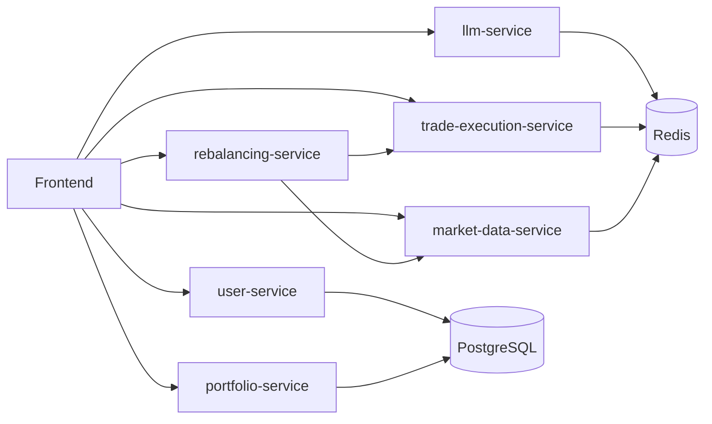

# Robo-Advisor Platform

An AI-powered, cloud-ready robo-advisor built as a teaching/reference app. It showcases a pragmatic microservices architecture, an LLM-driven onboarding flow, automated portfolio rebalancing, and a simple React UI. Everything runs locally via Docker Compose and is deployable to Kubernetes (manifests included).

## Repository contents

Top-level:
- `docker-compose.yml` — Local orchestration of all services (ports below)
- `smoke-test.sh` — Opens the frontend and performs basic health/API checks
- `README.md` — This document
- `.env.example` — Example environment variables for local runs (copy to `.env` and never commit)

Frontend (React 18):
- `frontend/` — Minimal UI with onboarding and dashboard
    - `src/components/SimpleOnboarding.jsx` — Chat-style onboarding using the LLM service
    - `src/components/SimpleDashboard.jsx` — Health tiles, market sample, trade test, rebalance demo

Backend services (FastAPI):
- `services/user-service/` (8080) — Auth/user stub with JWT patterns
- `services/market-data-service/` (8082) — Price quotes via yfinance (safe access with fallbacks)
- `services/portfolio-service/` (8083) — Portfolio logic (enhanced_app.py)
- `services/rebalancing-service/` (8084) — Rebalance decisions and trade generation
- `services/llm-service/` (8085) — Conversational onboarding with OpenAI Python v1 client
- `services/trade-execution-service/` (8086) — Paper trading engine, fees/slippage model

Infrastructure:
- `k8s/namespace.yaml` — Namespace, quotas, limits
- `k8s/database.yaml` — Postgres and Redis Deployments + Services
- `infrastructure/k8s/configmaps/app-config.yaml` — Shared app env + frontend env
- `infrastructure/k8s/secrets/app-secrets.yaml` — Secret scaffold (fill base64 values)
- `infrastructure/k8s/deployments/*.yaml` — Deployments + Services for all apps

## Architecture overview

Services and ports (as in docker-compose):
- Frontend: 3000
- user-service: 8080
- market-data-service: 8082
- portfolio-service: 8083
- rebalancing-service: 8084
- llm-service: 8085
- trade-execution-service: 8086
- Datastores: Postgres 5432, Redis 6379

Key interactions:
- Frontend calls each service directly from the browser (CORS enabled where needed)
- Rebalancing-service pulls prices from market-data-service, generates orders, and calls trade-execution-service
- LLM-service processes onboarding chat and extracts user preferences

Design choices:
### Diagram

Rendered PNG for slides: `docs/architecture.png` (generated from `docs/architecture.mmd`).

- Decimal for money math (never float) and 2/4 DP rounding
- Pydantic models with validation; FastAPI async endpoints
- Conservative defaults and fallbacks (e.g., yfinance history when fast_info unavailable)
- Environment-driven configuration; secrets isolated in K8s Secrets

## Service details

Rebalancing Service (8084)
- Endpoints: `/health`, `/check-rebalance`, `/generate-trades`, `/execute-rebalance`
- Decimal-safe drift calc; threshold driven (vix-aware hook) + 90-day calendar trigger
- Env vars: `MARKET_DATA_URL`, `TRADE_EXECUTION_URL`, `MIN_TRADE_USD` (demo-friendly)
- CORS enabled for 3000/3001

Trade Execution Service (8086)
- Paper trading with market impact + fees; returns filled orders
- Stores demo executions/holdings in Redis for quick feedback
- Endpoints: `/health`, `/execute`, `/bulk-execute` (where implemented)

Market Data Service (8082)
- Uses yfinance with safe access patterns: fast_info when available; fallback to history
- Endpoint: `/quote/{symbol}` returning a price and select fields
- Note: `ALPHA_VANTAGE_API_KEY` and `POLYGON_API_KEY` are placeholders and not used by default

LLM Service (8085)
- OpenAI Python v1 client with timeouts and mock fallback
- Chat endpoint `/chat` used by the onboarding component

Portfolio Service (8083)
- Enhanced portfolio logic stub; CORS enabled where browser access is expected

User Service (8080)
- Basic JWT-handling patterns for future expansion

## How to run locally

1) Ensure Docker is running; copy/set your `.env` (OpenAI key recommended for live LLM)
2) Start everything: `docker-compose up -d`
3) Visit the UI: http://localhost:3000
4) Optional sanity: run `./smoke-test.sh` to open the UI and call health/test endpoints

Service URLs (local):
- user: http://localhost:8080/health
- market data: http://localhost:8082/health
- portfolio: http://localhost:8083/health
- rebalancing: http://localhost:8084/health
- llm: http://localhost:8085/health
- trade execution: http://localhost:8086/health

## Try the demo

End-to-end in the UI
- Open http://localhost:3000 (docker-compose up -d)
- Onboarding: use the chat or click “Skip Chat - Use Quick Setup” to populate preferences
- Dashboard: scroll to the action buttons and click:
    - “🧮 Check Rebalancing” to compute drift and threshold
    - “🔧 Execute Rebalance” to generate and submit orders via trade-execution

Expected results
- Check shows fields like: `should_rebalance`, `drift`, `threshold`, and `calendar_trigger`
- Execute shows a small set of orders (AAPL/MSFT); fills are simulated with prices/fees
- If no orders appear, reduce the minimum trade notional by setting `MIN_TRADE_USD=10` for the rebalancing-service

Optional: call the APIs directly
- Check rebalance (POST http://localhost:8084/check-rebalance)
    Request body:
    {
        "portfolio": {
            "user_id": "demo-user",
            "holdings": {"AAPL": 10, "MSFT": 10},
            "target_allocation": {"AAPL": 0.6, "MSFT": 0.4},
            "last_rebalanced": "2024-01-01T00:00:00Z"
        },
        "market_conditions": {"vix": 18, "sp500_trend": "neutral"}
    }

- Execute rebalance (POST http://localhost:8084/execute-rebalance)
    Request body:
    {
        "portfolio": {
            "user_id": "demo-user",
            "holdings": {"AAPL": 10, "MSFT": 10},
            "target_allocation": {"AAPL": 0.6, "MSFT": 0.4},
            "last_rebalanced": "2024-01-01T00:00:00Z"
        },
        "trigger_type": "strategic"
    }

Tip: `./smoke-test.sh` also exercises a minimal path across services.

## Kubernetes deployment (EKS-ready scaffold)

1) Create namespace/resources:
- `kubectl apply -f k8s/namespace.yaml`
- Adjust `k8s/database.yaml` storageClassName to your cluster (or remove it to use default), then apply it

2) App config and secrets:
- Edit `infrastructure/k8s/secrets/app-secrets.yaml` to include base64-encoded values
- `kubectl apply -f infrastructure/k8s/configmaps/app-config.yaml`
- `kubectl apply -f infrastructure/k8s/secrets/app-secrets.yaml`

3) Deploy services:
- Update image names in `infrastructure/k8s/deployments/*.yaml` to your registry
- `kubectl apply -f infrastructure/k8s/deployments/`

4) Access frontend:
- The sample manifest uses NodePort 30000; consider adding an Ingress + TLS for production

Full cloud walkthrough with EKS, ECR, and Chaos Mesh: see `docs/deployment.md`.

Chaos experiments (ready-to-apply manifests):
- `infrastructure/chaos/kill-random-pod.yaml`
- `infrastructure/chaos/delay-market-data.yaml`
- `infrastructure/chaos/stress-llm.yaml`

## Why this satisfies project goals

Return on Investment (ROI)
- Trades execute with realistic prices/fees; rebalancing aligns holdings to targets
- Foundation for ROI/PnL reporting (holdings + executions + prices already present)

Scalability & Performance
- Microservices with clear boundaries; async FastAPI and lightweight payloads
- Rebalancing logic encapsulated for batch/queued execution (ready for scale-out)
- Kubernetes manifests enable horizontal scaling (add HPAs as a next step)

Resilience to Chaos
- Health endpoints and timeouts/fallbacks in critical paths
- K8s primitives (probes, replicas) are in place; ready for Chaos Mesh/FIS experiments

Leveraging LLMs
- LLM onboarding is live via OpenAI v1; preferences extracted and used in the UI
- Timeouts and mocks ensure demos work offline; easily swapped for other providers

Cloud/EKS Experience
- Namespaced K8s manifests with config separation (ConfigMap/Secret)
- Clear service DNS and ports; frontend can target in-cluster service names

Security & Finance discipline
- JWT patterns; CORS scoped to dev origins
- Decimal-only money math with explicit rounding
- Pydantic validation on inputs and error handling in services

## What’s intentionally minimal (and next upgrades)

- ROI dashboarding and benchmark comparison (add PnL/returns and charts)
- Batch/segment rebalance with a worker/queue and bulk price fetch
- Observability: Prometheus/Grafana + structured logs and tracing
- Chaos engineering experiments and SLOs
- Ingress + TLS, HPAs, PodDisruptionBudgets, NetworkPolicies

These can be layered on without restructuring the codebase.

## Contributing

See `CONTRIBUTING.md` for local run steps, coding guidelines, testing, and commit conventions.

## Notes

- The `.env` includes placeholders for non-default data vendors (Alpha Vantage, Polygon); current market data uses yfinance and doesn’t require those keys.
- Rebalancing uses `TRADE_EXECUTION_URL` on port 8086 (aligned with docker-compose and K8s config).
- `smoke-test.sh` is safe to run repeatedly; it prints brief responses for quick validation.

— Built for demonstration purposes —
