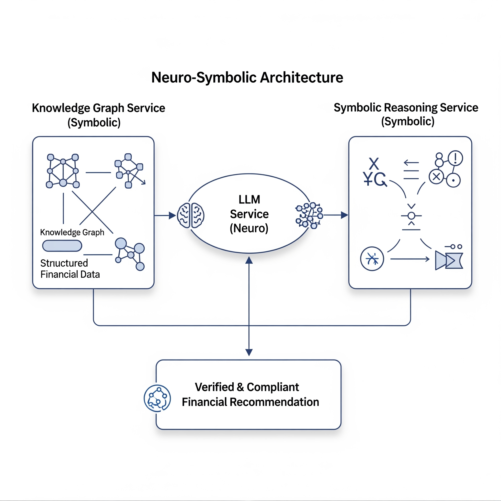

# Neuro‑Symbolic Additions

This project includes an optional, additive neuro‑symbolic layer to increase explainability and safety:

- Knowledge Graph Service (Neo4j) for reasoning and compliance checks
- Symbolic Reasoning Service (Z3) for formal verification of portfolios and trades
- Verified chat endpoint in LLM service that fuses neural output with KG + Symbolic signals
- Verified rebalancing endpoint that gates execution on verification/compliance



## Services & Ports

- knowledge-graph-service (FastAPI): 8087
- symbolic-reasoning-service (FastAPI): 8088
- Neo4j database: 7474 (browser), 7687 (bolt)

## Endpoints

Knowledge Graph Service (8087)
- GET /health → { status, neo4j_connected }
- POST /graph/populate → Seeds sample nodes/edges (AAPL/MSFT, factors, FINRA-4210)
- POST /reasoning/multi-hop → Finds simple multi-hop correlation paths
- POST /compliance/check → Checks a portfolio's allocations for concentration limit and optional ESG warnings

Symbolic Reasoning Service (8088)
- POST /verify/portfolio → Ensures weights sum to 1, max single position <= limit, min diversification
- POST /verify/rebalancing → Validates trades move toward target and do not create negatives
- POST /generate/shacl → Produces a basic SHACL shape for illustrative constraints

LLM Service (8085)
- POST /chat/verified → Combines neural response with KG context and optional verification

Rebalancing Service (8084)
- POST /execute-rebalance/verified → Generates trades, verifies with Z3, checks KG compliance, adjusts if needed

## Local Run

1) Start stack:
```bash
docker-compose up -d
```
2) Check KG readiness (Neo4j may take a bit):
```bash
curl -sS http://localhost:8087/health
```
If `neo4j_connected` is false, wait and retry. If Neo4j fails with "No space left on device", free space:
```bash
docker system prune -af
docker volume prune -f
```
3) Seed the graph and try reasoning:
```bash
curl -sS -H 'Content-Type: application/json' -d '{}' http://localhost:8087/graph/populate
curl -sS -H 'Content-Type: application/json' -d '{"query":"find correlation paths for AAPL","max_hops":3}' http://localhost:8087/reasoning/multi-hop
```
4) Verified flows:
```bash
# Verified rebalancing
curl -sS -H 'Content-Type: application/json' \
  -d '{"portfolio":{"user_id":"demo","holdings":{"AAPL":10,"MSFT":10},"target_allocation":{"AAPL":0.6,"MSFT":0.4},"last_rebalanced":"2024-01-01T00:00:00Z"},"trigger_type":"strategic"}' \
  http://localhost:8084/execute-rebalance/verified

# Verified chat
curl -sS -H 'Content-Type: application/json' \
  -d '{"user_id":"demo","message":"Build a diversified AAPL/MSFT tilt"}' \
  http://localhost:8085/chat/verified
```

## Frontend Hooks

- Dashboard has a "Knowledge Graph Query" box to POST to /reasoning/multi-hop
- A "Execute Rebalance (Verified)" button calls /execute-rebalance/verified and shows verification/compliance status

## Notes

- CORS is permissive for local dev; tighten for production.
- KG service defers Neo4j connection until first use and retries on demand; `/health` shows readiness without failing.
- The example compliance rule enforces a concentration limit (25%); adjust in seed or extend with more rules.
